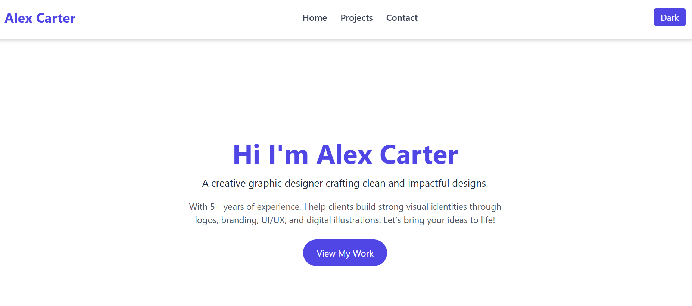
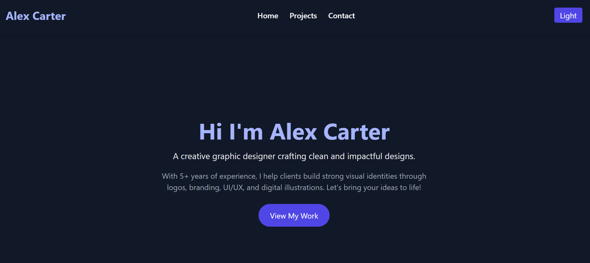

# 🎨 Alex Carter - Graphic Designer Portfolio

A modern, responsive portfolio website built with React and Tailwind CSS to showcase the creative work of Alex Carter, a professional graphic designer.

## ✨ Features

- 🔁 Fully responsive layout (mobile & desktop)
- 🌙 Dark mode toggle
- 🖼️ Project showcase section
- 📩 Static contact form
- ⚡ Built with Vite for fast development

## 🛠 Tech Stack

- **Frontend**: React (with Hooks)
- **Styling**: Tailwind CSS v3
- **Build Tool**: Vite

## 📷 Screenshots

|  

 |

## 🚀 Installation & Local Development

Clone the project and run it locally:

git clone https://github.com/yourusername/alex-carter-portfolio.git
cd alex-carter-portfolio
npm install
npm run dev

## Project Structure
alex-carter-portfolio/
├── public/
│   └── index.html
├── src/
│   ├── components/
│   │   ├── Navbar.jsx
│   │   ├── Home.jsx
│   │   ├── Projects.jsx
│   │   └── Contact.jsx
│   ├── App.jsx
│   ├── main.jsx
│   └── index.css
├── tailwind.config.js
├── postcss.config.js
├── package.json
└── README.md

## 🌍 Live Demo
..

## 🙋‍♂️ Author
Name: Arslan Akmal
Github: https://github.com/Arslan-Akmal
LinkedIn: https://www.linkedin.com/in/arslan-akmal-4a43a6300/

